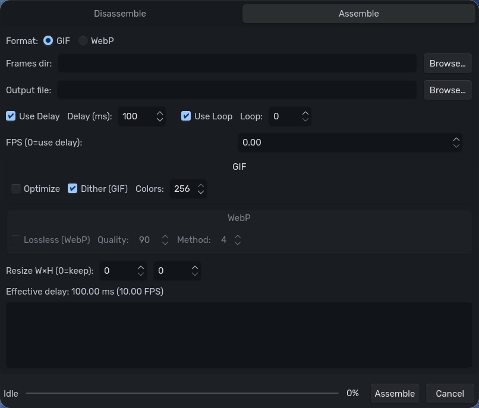

<p align="center">
  
</p>

<h1 align="center">Animagic</h1>

<p align="center">
  A Qt6 desktop app that disassembles GIF/WebP animations into frames and reassembles them back with fine‑grained controls — powered by ImageMagick.
</p>

---

## ✨ Features

- **Disassemble** animated **GIF/WebP** into common still formats (PNG/JPG/BMP), with optional coalescing.
- **Assemble** animations from a folder of frames:
  - **Format**: GIF or WebP
  - **Timing**: FPS (overrides delay) or Delay (ms), optional loop count
  - **GIF options**: Optimize, Dither, Palette Colors (2–256)
  - **WebP options**: Lossless toggle, Quality (0–100), Method (0–6)
  - **Resize**: Width × Height (0 = keep original)
- **Non‑blocking UI**: heavy work runs off the UI thread (QThread) with a TaskBar that shows status & progress.
- **Polished UX**:
  - Format selection (GIF/WebP) at the top
  - Relevant controls auto‑enable; irrelevant ones are greyed out
  - Live “effective timing” readout based on FPS/Delay
- **Native integration** (Linux):
  - Desktop file + icon install
  - Wayland/Hyprland friendly (desktop app id set to `animagic`)

---

## 📸 Screenshots

<p align="center">
  
</p>

---

## 🧰 Dependencies

**Runtime**
- Qt 6 (Widgets) — `qt6-base`
- ImageMagick 7 with C++ bindings — `imagemagick` / `Magick++`

**Build**
- CMake ≥ 3.18
- C++17 compiler (GCC/Clang)
- pkg-config

### Package names (quick reference)

- **Arch Linux**: `qt6-base`, `imagemagick`, `cmake`, `pkgconf`, `base-devel`
- **Debian/Ubuntu**: `qt6-base-dev`, `libmagick++-dev`, `cmake`, `pkg-config`, `build-essential`
- **Fedora**: `qt6-qtbase-devel`, `ImageMagick-c++-devel`, `cmake`, `gcc-c++`, `pkgconf-pkg-config`

---

## 🛠️ Build from source

```bash
git clone https://github.com/Skylius/animagic.git
cd animagic
mkdir -p build && cd build
cmake .. -DCMAKE_BUILD_TYPE=Release
cmake --build . -j
./animagic
```

> **Windows:** Install Qt 6 and ImageMagick with C++ headers/libraries (Magick++). Ensure their `bin/` directories are on PATH at runtime.

---

## 📦 Install (Linux)

```bash
# from build/
sudo cmake --install .
```

Installs:
- `/usr/bin/animagic`
- `/usr/share/applications/animagic.desktop`
- `/usr/share/icons/hicolor/256x256/apps/animagic.png`

**Wayland/Hyprland:** if the icon doesn’t refresh immediately, update caches:
```bash
sudo gtk-update-icon-cache -f /usr/share/icons/hicolor || true
sudo update-desktop-database /usr/share/applications || true
```

---

## 🧪 Usage

1. **Disassemble**
   - Disassemble tab → choose input (`.gif`/`.webp`) and output folder → **Disassemble**.

2. **Assemble**
   - Assemble tab → choose **Format** (GIF/WebP), **Frames dir**, **Output file**.
   - Timing via **FPS** (overrides) or **Use Delay (ms)**; optional **Use Loop**.
   - Tweak format‑specific options; **Assemble** from the taskbar.

---

## 🔧 Troubleshooting

- **ImageMagick link errors** (`DestroyExceptionInfo`, etc.): ensure **Magick++** dev package is installed and visible to CMake.
- **Icon not appearing on Wayland docks/launchers**: install the app (so `.desktop` + icon are on disk) and refresh caches.

---

## 🗺️ Scope

- Focused utility for **GIF/WebP** assembly and disassembly.
- Not a frame editor/timeline tool.

---

## 🏷️ License

See `LICENSE`.
